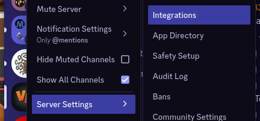
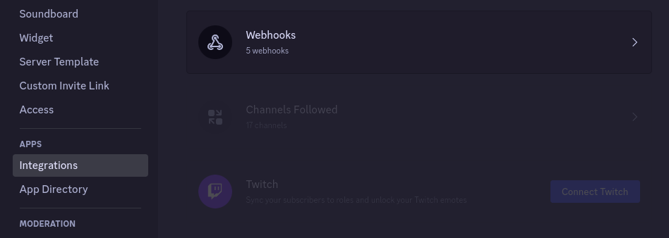
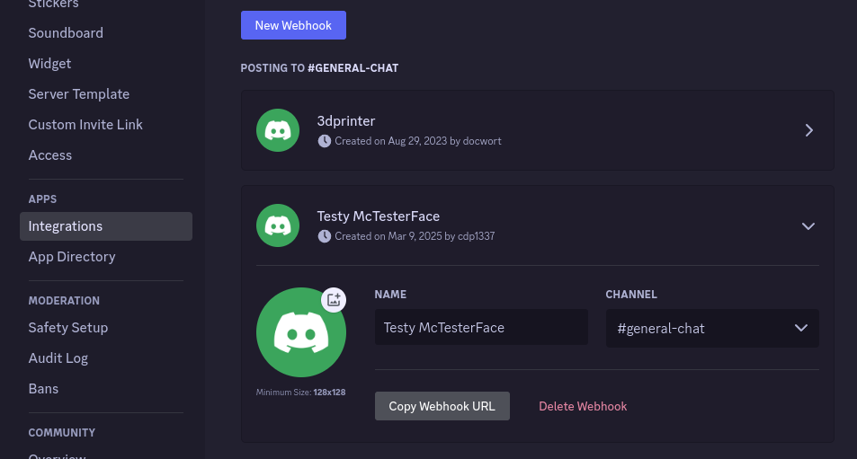

# Utility for installing Palworld Dedicated Server on Linux

Wanna chat?

[](https://discord.gg/48hHdm5EgA)

Help fund the project

[](https://ko-fi.com/Q5Q013RM9Q)


## What does it do?

This script will:

* Install Steam and SteamCMD
* Create a `steam` user for running the game server
* Install Palworld Dedicated Server using standard Steam procedures
* Setup a systemd service for running the game server
* Add firewall service for game server (with UFW)
* Adds a management script for controlling your server
* Adds a watching script for monitoring your server

---


## Installation on Debian 12 or Ubuntu 24.04

To install Palworld Dedicated Server on Debian 12 or Ubuntu 24.04,
download and run [linux_install_game_palworld.sh](dist/linux_install_game_palworld.sh)
as root or sudo.

* Debian 12 tested on Digital Ocean, OVHCloud, and Proxmox.
* Ubuntu 24.04 tested on Proxmox.

Quick run (if you trust me, which you of course should not):

```bash
sudo su -c "bash <(wget -qO- https://raw.githubusercontent.com/VeraciousNetwork/Palworld-Linux/main/dist/linux_install_game_palworld.sh)" root
```

Installer should run and provide the following output:
```
================================================================================
                               Palworld Installer

Reading package lists... Done
Building dependency tree... Done
Reading state information... Done
python3-venv is already the newest version (3.9.2-3).
sudo is already the newest version (1.9.5p2-3+deb11u1).
wget is already the newest version (1.21-1+deb11u1).
curl is already the newest version (7.74.0-1.3+deb11u14).
0 upgraded, 0 newly installed, 0 to remove and 33 not upgraded.
Installing SteamCMD...
...
Loading Steam API...IPC function call IClientUtils::GetSteamRealm took too long: 43 msec
OK

Connecting anonymously to Steam Public...OK
Waiting for client config...OK
Waiting for user info...OK
 Update state (0x5) verifying install, progress: 0.20 (7340032 / 3623010449)
...
 Update state (0x5) verifying install, progress: 90.67 (3284866717 / 3623010449)
Success! App '2394010' fully installed.
firewall_allow/UFW: Allowing 8211/udp from any...
Skipping adding existing rule
Skipping adding existing rule (v6)
================================================================================
                     Palworld Server Installation Complete

Game server will auto-update on restarts and will auto-start on server boot.

Game files:     /home/steam/Palworld/AppFiles/
Game settings:  /home/steam/Palworld/PalWorldSettings.ini

Next steps: configure your server by running
sudo /home/steam/Palworld/manage.py
```

**IMPORTANT** to complete installation, run `sudo /home/steam/Palworld/manage.py` to configure your server. 


### Advanced Usage

Download the script and retain for later management use.

```bash
wget https://raw.githubusercontent.com/VeraciousNetwork/Palworld-Linux/main/dist/linux_install_game_palworld.sh
chmod +x linux_install_game_palworld.sh
```

Re-running the installation script on an existing server **is safe** and will **not** overwrite 
or delete your existing game data.  To install new features as they come out, simply
re-download the script installer via the steps above and re-run the installer application.


## Finding Your Game

Once installed and running, you should be able to search for your server
in the "Unofficial" server list after ticking "Show Player Servers".


(This was an added step Wildcard implemented to make it harder for players to find servers
that are hosted outside Nitrado's network...)


## Features

Because it's managed with systemd, standardized commands are used for managing the server.
This includes an auto-restart for the game server if it crashes.

By default, enabled game maps will **automatically start at boot**!

A start and stop script is included in `/home/steam/ArkSurvivalAscended`
for starting and stopping all maps, (not to mention updating before they start).

Sets up multiple maps on a single install, and **all of them can run at the same time**
(providing your server has the horsepower to do so).

If your single server cannot run all maps, this script supports multiple servers
sharing the same `cluster` directory via NFS to allow players to jump between maps,
even if they are on different physical servers.


## Directory Structure

```
/home/steam/Palworld
├── AppFiles/                  # Game Server Files (directly managed from Steam)
├── PalWorldSettings.ini       # Game Server Configuration
├── update.sh                  # Update game files (only when server stopped)
└── manage.py                  # Management console for game server and settings
```


## Managing your Server (Easy Method)

Once installed, run `sudo /home/steam/Palworld/manage.py` to access the management console:

### First Run

The first time running the management configuration, you will be prompted for a few options.

```bash
sudo /home/steam/Palworld/manage.py 


== First Run Configuration ==

Enable API integration? (recommended) [Y/n]: 
Enter the server name: Veracious Network Palworld
Enter the server description: 
Require a password for players to join? [y/N]:
```

```
== Welcome to the Palworld Linux Server Manager ==

Found an issue? https://github.com/VeraciousNetwork/Palworld-Linux/issues
Want to help financially support this project? https://ko-fi.com/Q5Q013RM9Q

      Server Name:  (opt 1)  Veracious Network Palworld 
             Port:  (opt 2)  8211                       
   Direct Connect:           1.2.3.4:8211         
  Player Password:  (opt 3)                             
        Crossplay:  (opt 4)  Steam, Xbox, PS5, Mac      
           Status:           🛑 Stopped                 
       Auto-Start:  (opt 5)  ✅ Enabled                 
          Version:           ⛔ Failed to connect to API
   Players Online:           None                       

Configure: [A]dmin password/API/RCON | [D]iscord
Control: [S]tart | [U]pdate
or [Q]uit to exit
```

The main screen of the management UI shows some useful information, 
and provides an interface to start/stop/update the server.

### Admin password and RCON management

Pressing `a` will open the admin password and RCON management screen:

```
== Admin and RCON Configuration ==

  Admin Password:  (opt 1)  abcdefghijklmnop  Password for connecting to RCON or the REST API
     RCON Status:  (opt 2)  ❌ Disabled       Enable to allow remote control of the server   
       RCON Port:  (opt 3)  25575             Port for RCON connections                      
     REST Status:  (opt 4)  ✅ Enabled        Enable to allow remote control of the server   
       REST Port:  (opt 5)  8212              Port for REST API connections

Enter option 1-5 or [B]ack:
```

This allows you to change the admin/API/rcon password, as well as enable or disable RCON.

Note, you should leave the REST API enabled, as it allows the script to warn users upon restarts and 
gracefully save prior to shutting down the server.


### Discord Integration

```
== Discord Integration ==

Discord integration is currently available and enabled!

Discord Webhook URL:  https://canary.discord.com/api/webhooks/1348175098775081070/xjCt************
Discord Channel ID:   919624281904783472
Discord Guild ID:     909843670214258729
Discord Webhook Name: Testy McTesterFace

[D]isable | [C]hange Discord webhook URL | configure [M]essages | [B]ack
```

Provides an option to automatically send messages to Discord on start, restart, and stop
events for maps.  Default messages provided, and can be customized to match your preferences.

To setup Discord integration, grab a webhook URL from Discord by browsing to 
Server Settings -> Integrations



Then Webhooks



And create a new webhook and configure as desired.



Copy the webhook URL and paste into the management console when prompted.


### Stopping / Starting / Restarting

From the main menu overview, the options `s`, `t`, and `r` respectively
will **s**tart, s**t**op, and **r**estart the game server.

When REST is enabled and available, (default), the stop logic will first check if there are 
any players currently on the map.  If there are, it will send a 5-minute warning to all players
and then wait for a minute before another warning is sent if they are still logged in.

If all players have left the map prior to the countdown completing, 
the server will skip the remaining countdown and will proceed with the shutdown.

A world save is automatically requested on the map prior to shutdown.

Discord messages are sent prior to shutdown and after startup.


### Updating

If the game server is stopped, the `u` option will update the game server files from Steam.


## Managing with systemd (manual method)

Since this integrates with systemd, all the standard OS commands are available.

### Start, Stop, Restart

```bash
sudo systemctl start palworld
```

```bash
sudo systemctl restart palworld
```

```bash
sudo systemctl stop palworld
```

```bash
sudo systemctl enable palworld
```

Enabling a map will set it to start at boot, but it **will not** start the world immediately.
use `sudo systemctl start ...` to start the game manually.

---

```bash
sudo systemctl disable palworld
```

Disabling a map will prevent it from starting at boot, but it **will not** stop the server.
use `sudo systemctl stop ...` to stop the requested world manually.

---


### Configuring the game ini

Configuration of your server via the configuration ini is available in `/home/steam/Palworld/PalWorldSettings.ini`

```bash
sudo -u steam nano /home/steam/Palworld/PalWorldSettings.ini
```


### Automatic restarts

Want to restart your server automatically at 5a each morning?

Edit crontab `sudo nano /etc/crontab` and add:

```bash
0 5 * * * root systemctl restart palworld
```

(0 is minute, 5 is hour in 24-hour notation, followed by '* * *' for every day, every month, every weekday)


## Utilized libraries

* [Scripts Collection compiler by eVAL](https://github.com/eVAL-Agency/ScriptsCollection) (AGPLv3)
* [SteamCMD by Valve](https://developer.valvesoftware.com/wiki/SteamCMD)
* curl 
* wget 
* sudo
* systemd
* python3
* ufw


## Other game servers

* [ARK Survival Ascended](https://github.com/cdp1337/ARKSurvivalAscended-Linux)